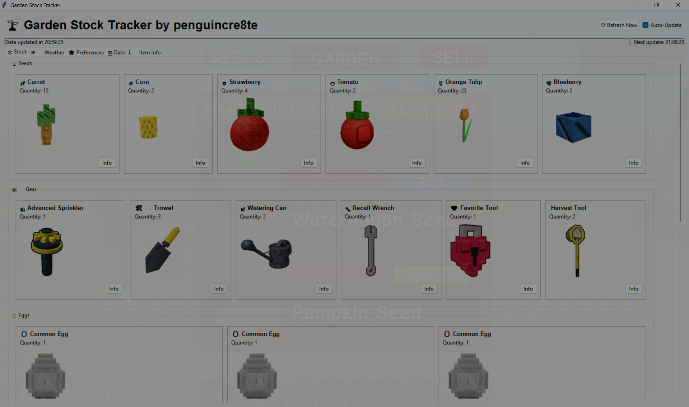

# Grow a Garden Stock Monitor

## Overview
The **Grow a Garden Stock Monitor** is a tool designed to track and optimize plant inventory in *Grow a Garden*. It provides real-time monitoring of available seeds to help players manage their garden efficiently.

## Features
- **Real-time Stock Tracking:** Displays current stock of seeds, fruits, and pollinated plants.
- **Event Item Monitoring:** Tracks *Honey*, *Bizzy Bee* event resources, and seasonal items.
- **Plant favouriting:** You can highlight plants you like!
## Installation
1. Download main.exe
